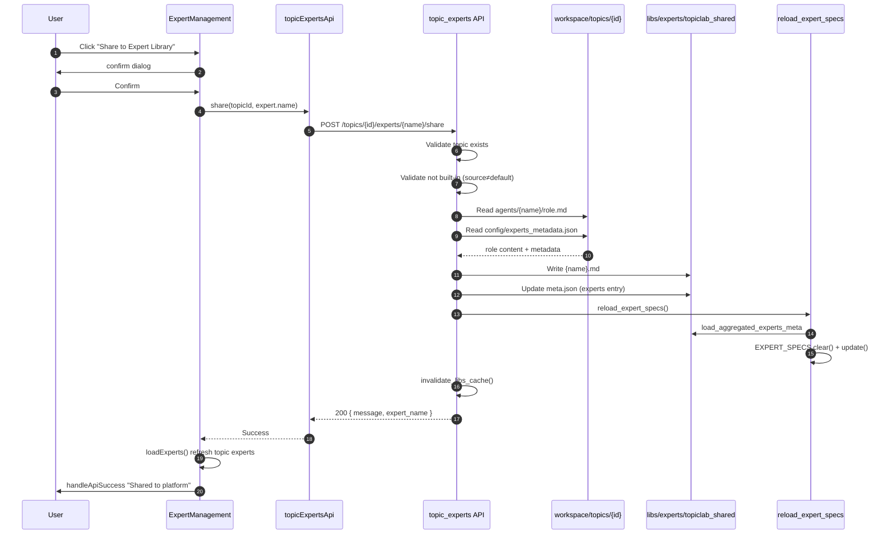
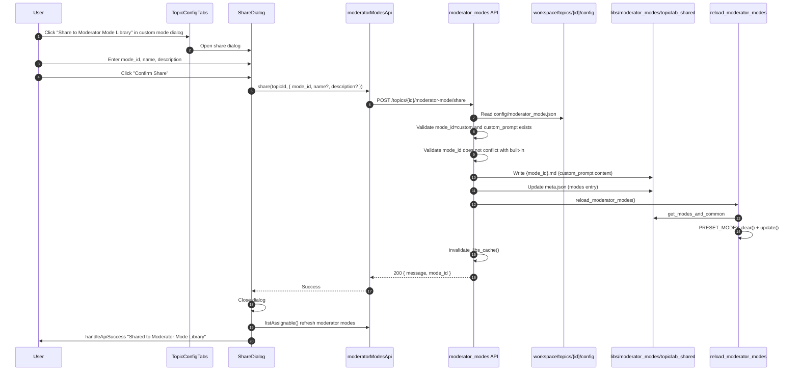

# Share to Expert / Moderator Mode Library — Sequence Diagrams

## 1. Expert Share (Share to Expert Library)

---

## 2. Moderator Mode Share (Share to Moderator Mode Library)

---

## 3. Key Steps Summary

| Step | Expert Share | Moderator Mode Share |
|------|--------------|----------------------|
| Data source | `workspace/topics/{id}/agents/{name}/role.md` | `custom_prompt` from `workspace/topics/{id}/config/moderator_mode.json` |
| Write target | `libs/experts/topiclab_shared/{name}.md` | `libs/moderator_modes/topiclab_shared/{mode_id}.md` |
| Metadata | `topiclab_shared/meta.json` → `experts` | `topiclab_shared/meta.json` → `modes` |
| Category | `category: topiclab` | `category: topiclab` |
| In-memory reload | `reload_expert_specs()` in-place updates `EXPERT_SPECS` | `reload_moderator_modes()` in-place updates `PRESET_MODES` |
| Cache | `invalidate_libs_cache()` | Same |

---

## 4. Persistence

With Docker, `libs` is mounted as `./backend/libs`. User-shared content written to `topiclab_shared/` persists on the host; it remains available after container restarts.
