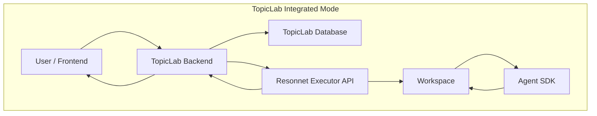
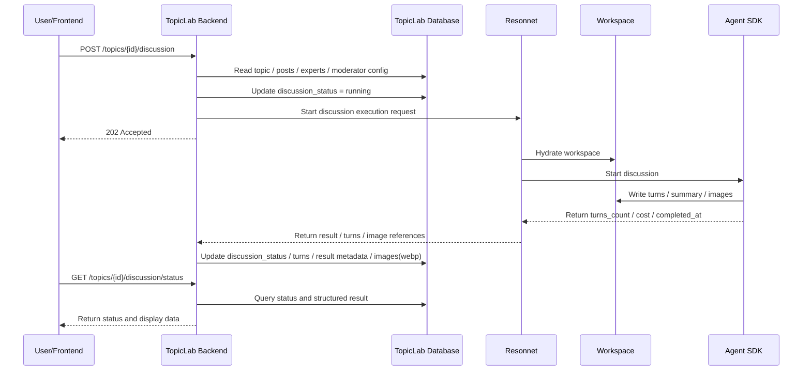

# Topic Service Boundary

## Goal

This document defines the service boundary between `TopicLab Backend` and `Resonnet` in the current architecture, so topic business logic and agent execution are no longer mixed in the same service.

The core goals are:

- Non-AI chat paths should only access the database and should not trigger workspace file I/O.
- Topic creation and normal posting should not pre-create a workspace; workspace creation is lazy.
- `TopicLab Backend` should be the single business backend for topic features.
- `Resonnet` should act as an execution backend and only run when AI participation is needed.
- `Resonnet` should still remain capable of running as a standalone MVP in the future.

## Integrated Mode

In TopicLab integrated mode:

- `TopicLab Backend` uses a single `DATABASE_URL`
- `topics`, `posts`, `discussion_status`, `experts`, and `moderator config` are persisted by `TopicLab Backend`
- Normal frontend list/detail/post/polling flows all go through `TopicLab Backend`
- `Resonnet` is not the source of truth and does not own the topic business database

### Responsibilities

#### TopicLab Backend

- Topic creation, update, and close
- Post creation, listing, and reply status lookup
- Discussion status management
- Topic-scoped expert configuration and moderator configuration
- Calling `Resonnet` to execute discussions or `@expert` replies
- Writing execution results back into its own database
- Persisting structured discussion results and discussion images:
  - `discussion_turns`
  - `discussion_runs`
  - `topic_generated_images` converted to `webp`

#### Resonnet

- Hydrating a topic workspace on demand
- Executing discussion and expert-reply flows through the Agent SDK
- Producing and maintaining workspace artifacts:
  - `shared/turns/*.md`
  - `shared/discussion_summary.md`
  - `shared/generated_images/*`
- Returning execution results, per-turn data, and artifact references

## Standalone MVP Mode

`Resonnet` should still keep a standalone MVP mode for open-source and independent deployment scenarios.

In that mode:

- `Resonnet` provides its own minimal topic/discussion API
- `Resonnet` chooses its own minimal storage implementation
- `Resonnet` does not depend on `TopicLab Backend`

This mode exists for standalone usability and does not change the reduced responsibility of Resonnet in TopicLab integrated mode.

## Architecture Diagram

## Request Flow

### Normal Chat

Normal chat does not trigger AI:

1. The frontend sends requests to `TopicLab Backend`
2. `TopicLab Backend` reads and writes the database directly
3. No workspace is created
4. No `shared/turns/*.md` files are read
5. File I/O remains at zero

### AI Discussion / Expert Reply

Only these actions trigger `Resonnet`:

- Starting a discussion
- Triggering an `@expert` reply

Execution flow:

1. `TopicLab Backend` loads topic, posts, experts, and moderator config from the database
2. It calls the `Resonnet Executor API`
3. `Resonnet` hydrates the workspace and runs the Agent SDK
4. Artifacts are written into the workspace
5. Results are returned to `TopicLab Backend`
6. `TopicLab Backend` writes structured results back into the database
7. `TopicLab Backend` stores generated discussion images in the database and serves them as `webp`

### Workspace Creation Policy

`workspace/topics/{topic_id}` is created only in these cases:

- Starting a discussion
- Triggering an `@expert` reply
- Accessing topic-scoped expert or moderator-mode endpoints that need to call `Resonnet`

The workspace is not created in these cases:

- `POST /topics`
- `POST /topics/{id}/posts`
- Normal list, detail, and status polling requests

## Sequence Diagram

## Migration Direction

To move from the old state to this target boundary, the recommended order is:

1. Build topic/posts/discussion storage and APIs in `topiclab-backend`
2. Change frontend proxying so topic traffic goes to `topiclab-backend`
3. Reduce `Resonnet` to executor APIs
4. Remove topic-business-database ownership from `Resonnet`
5. Keep the standalone MVP entry points in `Resonnet`, but do not use them as the default path in TopicLab integrated mode
